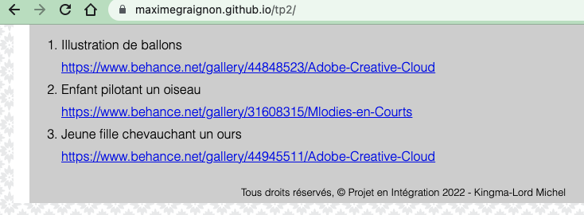
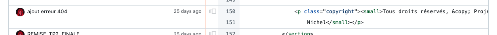
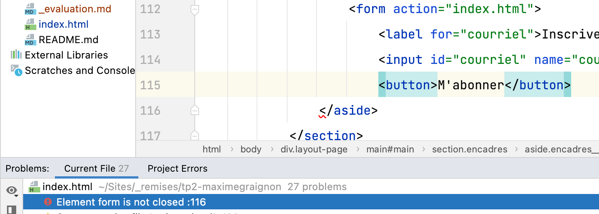

# Grille d'évaluation pour le TP2
- [X] __Balisage sémantique et structurel__ (3.4/4 points)
- [X] __Stratégie d’intégration complétée__
- [X] __Styles CSS (base)__ (2.85/3 points)
    - charte typographique responsive
    - rangées 3-4-5-7-8
- [X] __Styles CSS (défis du header et du footer)__ (.95/1 point)
    - rangées 1-2-6
- [X] __Versionnage__ (1 point)
- [X] __Mise en ligne sur Github Pages__ (1 point)

## Note et commentaires
 9.2 / 10 

- Excellent travail d'intégration...
- Quoique... ça part ben mal quand la première chose que j'observe est que la page Web est signée par une autre personne que @MaximeGraignon.  
    
  Heureusement que tu as bien utilisé le versionnage car je peux voir avec `git blame`   
    
  que cette `odieuse` usurpation d'identité remonte à seulement quelques `commit` et résulte d'un travail collaboratif + ou - bien géré.  
  Comme en [témoigne ce code](https://github.com/maximegraignon/tp2/commit/a5af01bede40a0e9238b0c02c6b37cffca1b870d)    
  __Bref inscrire vos deux noms dans les crédits?!__  
  Sachez qu'une remise d'un même fichier de code comme une fraude intellectuelle et valoir une note 0 pour toutes les personnes impliquées.

- Bravo à @michelkingmalord et à toi pour la documentation de la stratégie d'intégration
- Lors de la mise en ligne, éliminer les fichiers inutiles pour le Web (plusieurs fichiers .css inutilisés)

### html
- Peu d'[erreurs-html](images/erreurs-html.png)
  - Entre autres l'élément `<form>` n'était pas refermé
  

## Barème
| Barème | sur 1 |
|--------|-------|
| A+     | 1     |
| A      | 0.95  |
| B+     | 0.9   |
| B      | 0.85  |
| C+     | 0.8   |
| C      | 0.75  |
| D      | 0.65  |
